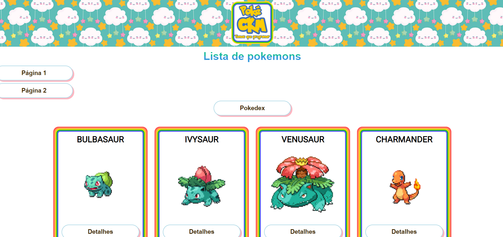
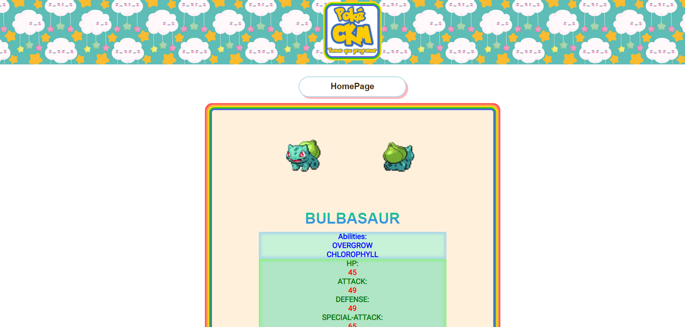
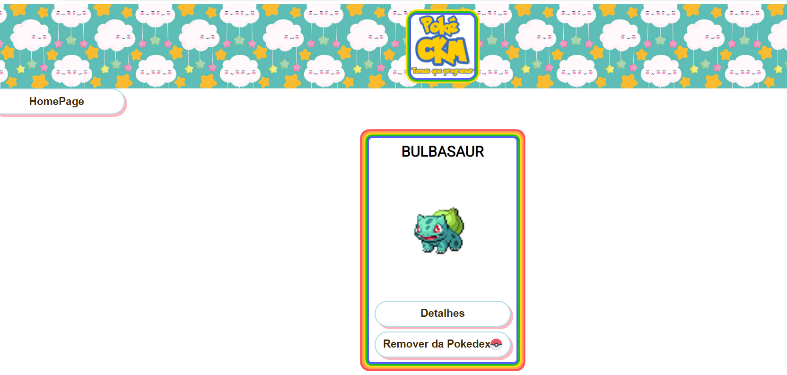

# Projeto de Fixação:  POKEDEX

<strong><em>LINK DO SURGE: [Pokedex](https://pokeckm.surge.sh/)</em></strong>

Esse site foi desenvolvido por Christian Cardeal de Miranda Penna Botto</em>, <em>Karen Naomi Cardoso Kubo </em> e <em>Maria Eduarda Lopes</em>.

Ele é um projeto de criação de uma página de  <strong>Pokedex</strong>, aonde o usário pode pesquisar seus pokémons preferidos!

O site é dividido em 3 páginas:
<li>Home</li>
<li>Pokedex</li>
<li>Detalhes</li>
 

A página <strong>Home</strong> é a tela inicial, aonde todos os pokémons são renderizados. Nela, o usuário pode selecionar a página da lista de pokemons que aparecerá, sendo 30 por vez.

Ao clicar em <strong> adicionar à pokedex</strong>, a pessoa adiciona esse pokemon a sua pokedex..

Já ao clicar em <strong>Pokedex</strong> o usuário é levado para a página de pokedex, aonde pode visualizar os pokemons que foram adicionados. Também há um botão de remover, aonde o pokémon removido retornará à página inicial (home).

Por último, em ambas as páginas (home e pokedex), no card de pokemons, há o botão <strong>Detalhes</strong>, que levará o usuário para a página de detalhes desse pokémon, com informações complementares sobre este.

Todos os componentes são responsivos para a tela de celular.

